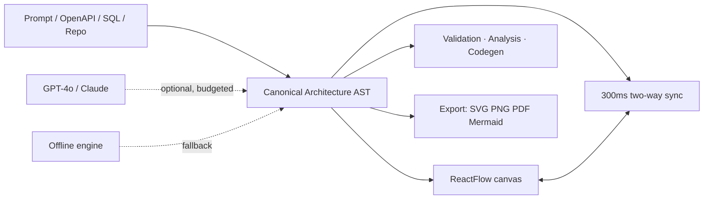

# ArchVision AI ⚡ Automatic UML Diagram Generator

Turn words, code, and schemas into production-ready UML diagrams — generated, edited, and exported in one place.

<!-- LIVE_DEMO_URL: replace this line with the Vercel URL once deployed — see docs/DEPLOYMENT.md -->
> **🚀 Live demo:** _coming soon — deploy takes ~10 minutes, steps in [`docs/DEPLOYMENT.md`](docs/DEPLOYMENT.md)._

## How it works



_Client: Next.js 14 + ReactFlow + Monaco. Server: typed REST routes → services → Prisma/Postgres. One app, one database — no microservices._

## Quick start

```bash
npm install
npm run dev          # http://localhost:3000 — sign in with "Demo access"
npm run typecheck && npm run lint && npm run test   # gates: must all pass
```

Need Postgres or AI keys? See [Configuration](#-configuration) — the app runs fully offline without either.

## ✨ Features

| Area | Capability |
| --- | --- |
| **Diagram engine** | Bi-directional Mermaid ↔ canvas, Executive ⇄ Engineering view modes |
| **AI copilot** | Streaming chat edits, design docs, architecture critic — with offline fallback |
| **Importers** | OpenAPI/Swagger → architecture + flow; SQL DDL → ER; GitHub repo → classes |
| **Quality gates** | 7-rule validation, coupling/cycle analysis, validation-gated export |
| **History** | Snapshots + restore, change log, ADRs linked to nodes |
| **Export** | SVG, PNG, PDF, PlantUML, Mermaid, JSON, TS/Java/Python/C# |

## 📊 Status

| Area | Status |
| --- | --- |
| Diagram engine, AI copilot (key required), validation, exports | ✅ Working |
| Auth | ⚠️ OAuth when configured; demo user otherwise — no email/password |
| Persistence | ⚠️ Postgres in `db` mode, localStorage otherwise |
| Sharing / real-time collaboration | 🚧 Roadmap — share dialog is preview-only |

## 🔑 Configuration

Copy `.env.example` → `.env`. Everything is optional except `NEXTAUTH_SECRET` in production:

```env
OPENAI_API_KEY=sk-...            # or ANTHROPIC_API_KEY — else offline engine
GITHUB_CLIENT_ID=...             # + SECRET for OAuth (demo access otherwise)
DATABASE_URL=postgresql://...    # + NEXT_PUBLIC_DATA_MODE=db for Postgres
AI_DAILY_REQUEST_BUDGET=50       # optional per-user AI cap; AI_PROVIDER_DISABLED=true kills provider calls
SENTRY_DSN=...                   # optional error tracking (+ NEXT_PUBLIC_SENTRY_DSN for browser)
NEXT_PUBLIC_POSTHOG_KEY=...      # optional analytics (4 events, see lib/analytics.ts)
```

Full matrix (deploy, rate limiting, observability): [`docs/DEPLOYMENT.md`](docs/DEPLOYMENT.md).

## 📜 Scripts

```bash
npm run dev           # local dev (separate .next-dev build dir)
npm run build         # production build (regenerates Prisma client)
npm run start         # serve production build
npm run lint          # ESLint, zero warnings
npm run typecheck     # tsc --noEmit, strict
npm run test          # 125 unit + integration tests (node --test)
npm run test:e2e      # Playwright: sign in → project → diagram → export (needs DATABASE_URL)
npm run db:migrate    # prisma migrate dev
npm run db:deploy     # prisma migrate deploy (production)
npm run db:seed       # optional demo user + Auth Service project
```

## 📚 Docs

- [`docs/DEPLOYMENT.md`](docs/DEPLOYMENT.md) — Vercel runbook, env matrix, UptimeRobot
- [`docs/BACKEND_ARCHITECTURE.md`](docs/BACKEND_ARCHITECTURE.md) — layered design, error taxonomy, transactions
- [`docs/EXECUTION_MANUAL.md`](docs/EXECUTION_MANUAL.md) — local setup end to end
- [`CONTRIBUTING.md`](CONTRIBUTING.md) — branches, commits, gates
- [`SECURITY.md`](SECURITY.md) — scanning + accepted risks

---

Built with Next.js 14, TypeScript (strict), Tailwind, ReactFlow, Mermaid, Monaco,
Zustand, Prisma 7 and the Vercel AI SDK. MIT licensed — see [LICENSE](LICENSE).
