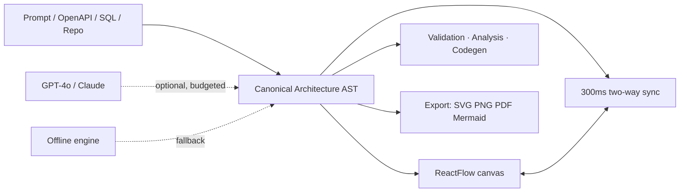

# ArchVision AI — Automatic UML Diagram Generator

Turn natural language, code repositories, and database schemas into production-ready UML diagrams — generated, edited, validated, and exported in one workspace.

<!-- LIVE_DEMO_URL: replace this line with the Vercel URL once deployed — see docs/DEPLOYMENT.md -->
> **Live demo:** coming soon. Deployment takes ~10 minutes — see [`docs/DEPLOYMENT.md`](docs/DEPLOYMENT.md).

---

## Table of contents

- [Overview](#overview)
- [How it works](#how-it-works)
- [Features](#features)
- [Tech stack](#tech-stack)
- [Quick start](#quick-start)
- [Configuration](#configuration)
- [Scripts](#scripts)
- [Testing and quality gates](#testing-and-quality-gates)
- [Architecture](#architecture)
- [Deployment](#deployment)
- [Security](#security)
- [Contributing](#contributing)
- [Documentation](#documentation)
- [License](#license)

---

## Overview

ArchVision AI is a full-stack Next.js application for software architecture modeling. It parses prompts, OpenAPI specifications, SQL DDL, and GitHub repositories into a canonical architecture AST, renders that model on an interactive canvas and code editor in two-way sync, and produces validated, exportable artifacts.

The application runs fully offline with zero configuration (demo auth, localStorage persistence, local extraction engine). Adding environment variables upgrades the same code paths to hosted Postgres, OAuth, and hosted LLM providers — no feature-code changes required.

**Current release:** `0.1.0` (private). See [Status](#status) for working vs. roadmap areas.

## How it works



Client: Next.js 14 App Router + ReactFlow + Monaco. Server: thin typed REST routes → services → repositories → Prisma/PostgreSQL. Single app, single database — no microservices.

## Features

| Area | Capability |
| --- | --- |
| Diagram engine | Bi-directional Mermaid ↔ canvas (drag, connect, minimap, dagre auto-layout, orthogonal edges); Executive ⇄ Engineering view modes with per-diagram persistence |
| Code editor | Monaco panel with Mermaid highlighting and error squiggles, 300 ms two-way sync |
| AI copilot | Streaming chat edits, node-targeted transforms, architecture critic, design-doc generation; offline extraction engine when no provider key is set |
| Importers | OpenAPI/Swagger (JSON/YAML) → architecture + flow diagrams; SQL DDL (Postgres/MySQL) → ER with PK/FK and cardinality; GitHub repo → class model; JSON/CSV/Prisma → diagrams |
| Quality gates | 7-rule 100-point validation (cycles, god classes, detached nodes, naming); coupling/cycle analysis; validation-gated export |
| History and decisions | Immutable version snapshots + restore, change log, prompt history, canvas comments, node-linked ADRs (Nygard markdown, `.md` export) |
| Collaboration | Workspaces with admin/editor/viewer/guest roles, audit log; real-time multiplayer is roadmap — share dialog is preview-only |
| Export and codegen | SVG, PNG (2x/4x), PDF, PlantUML, Mermaid, JSON; TypeScript, Java, Python, C# |
| Comfort | Command palette (Ctrl/Cmd K), keyboard shortcuts, skeletons, reduced-motion support |

### Status

| Area | State |
| --- | --- |
| Diagram engine, AI copilot, validation, analysis, codegen, exports | Working |
| Auth | OAuth (GitHub/Google) when configured; demo user otherwise; no email/password |
| Persistence | PostgreSQL in `db` mode; localStorage otherwise |
| Sharing / real-time collaboration | Roadmap |

## Tech stack

**Frontend:** Next.js 14 (App Router, `output: standalone`), React 18, TypeScript (strict), Tailwind CSS, ReactFlow (`@xyflow/react`), Mermaid, Monaco, Zustand, TanStack Query, framer-motion, Radix UI, recharts.

**Backend:** Next.js Route Handlers, Zod validation, NextAuth v5 (JWT sessions, Prisma adapter for OAuth accounts), Prisma 7 with `@prisma/adapter-pg` (`pg` driver), PostgreSQL 15+.

**AI:** Vercel AI SDK (`ai`, `@ai-sdk/openai`, `@ai-sdk/anthropic`) with SSE streaming; per-user daily budgets and a provider kill switch in `lib/ai/budget.ts`.

**Observability:** Sentry (`@sentry/nextjs`) and PostHog (`posthog-js`) — both optional and inert when unconfigured.

**Tooling:** ESLint (`next lint`, zero warnings), `tsc --noEmit`, Node test runner with a custom TS alias loader, Playwright for E2E, Dependabot + CodeQL in CI.

## Quick start

Prerequisites: Node.js 20+ (tested on 24.x), npm 10+, Git. PostgreSQL 15+ is optional — the app boots in zero-config demo mode without it.

```bash
git clone https://github.com/12POISON/ARCHvision-AI-uml.git
cd ARCHvision-AI-uml
npm install
npm run dev          # http://localhost:3000 — sign in with "Demo access"
```

Verify before every commit:

```bash
npm run typecheck && npm run lint && npm run test
```

All three gates must pass. See [Testing and quality gates](#testing-and-quality-gates).

## Configuration

Copy `.env.example` → `.env`. Everything is optional for local demo except `NEXTAUTH_SECRET` in production:

```env
OPENAI_API_KEY=sk-...            # or ANTHROPIC_API_KEY — else the offline engine is used
GITHUB_CLIENT_ID=...             # + GITHUB_CLIENT_SECRET for OAuth (demo access otherwise)
GOOGLE_CLIENT_ID=...             # + GOOGLE_CLIENT_SECRET for OAuth
DATABASE_URL=postgresql://...    # + NEXT_PUBLIC_DATA_MODE=db for Postgres persistence
NEXT_PUBLIC_DATA_MODE=db         # unset = localStorage zero-infra demo (default)
NEXTAUTH_SECRET=...              # required in production: openssl rand -base64 32
AI_DAILY_REQUEST_BUDGET=50       # optional per-user AI cap; AI_PROVIDER_DISABLED=true disables providers
SENTRY_DSN=...                   # optional (+ NEXT_PUBLIC_SENTRY_DSN for browser)
NEXT_PUBLIC_POSTHOG_KEY=...      # optional analytics (see lib/analytics.ts)
```

Notes:

- `NEXT_PUBLIC_*` values are inlined at build time — set `NEXT_PUBLIC_DATA_MODE=db` before `npm run build`. In `npm run dev` it is read live.
- Without `DATABASE_URL`, keep `NEXT_PUBLIC_DATA_MODE` unset so the app boots in demo mode instead of attempting Postgres connections.
- Keep placeholder keys (`sk-...`) empty — a non-empty placeholder is treated as configured and will break streaming.
- Full environment matrix, rate-limiting, and observability notes: [`docs/DEPLOYMENT.md`](docs/DEPLOYMENT.md). Local setup end to end: [`docs/EXECUTION_MANUAL.md`](docs/EXECUTION_MANUAL.md).

## Scripts

```bash
npm run dev           # local dev (isolated .next-dev build dir, hot reload)
npm run build         # prisma generate + production build
npm run start         # serve the production build
npm run lint          # ESLint, zero warnings allowed
npm run typecheck     # tsc --noEmit, strict
npm run test          # 125 unit + integration tests (node --test)
npm run test:e2e      # Playwright: sign in → project → diagram → export (needs DATABASE_URL)
npm run db:generate   # prisma generate
npm run db:migrate    # prisma migrate dev (local)
npm run db:deploy     # prisma migrate deploy (production)
npm run db:seed       # optional demo user + Auth Service project
npm run db:studio     # prisma studio
```

## Testing and quality gates

- `npm run typecheck` — strict TypeScript, zero errors.
- `npm run lint` — `next lint --max-warnings=0`.
- `npm run test` — 125 unit + integration tests via `node --test` with `tests/alias-loader.mjs` (resolves `@/` aliases and transpiles project TS). DB-backed suites (`idor`, `routes.db`) skip cleanly when `DATABASE_URL` is unreachable and always run in CI with Postgres.
- `npm run test:e2e` — Playwright + Chromium covering demo sign-in → project → AI-described diagram → canvas → SVG export. Requires a reachable `DATABASE_URL` (`npm run db:migrate` first); CI runs it as a separate job.
- `npm run build` — regenerates the Prisma client and produces a standalone Next.js build. Benign warnings only (Sentry/OpenTelemetry dynamic-require notes, `jose` Edge-runtime hints).

## Architecture

Layered, dependency-injected REST API. The frontend never touches the database directly — `lib/data/storage.ts` calls the HTTP API and falls back to localStorage when unreachable; reads are client-driven through a shared Zustand store (`lib/data/workspace-store.ts`).

```text
App Router routes (app/api/**)   thin: parse input, call one service, shape response
  → withApiHandler               session, rate limit, zod validation, envelopes, request ids
  → Services (lib/services/*)    business rules, transactions, idempotency, RBAC, quotas
  → Repositories                 Prisma ↔ DTO translation, ownership-scoped queries
  → Prisma / PostgreSQL
```

- Wire contract: success `{ ok: true, data }`; failure `{ ok: false, error: { code, message, requestId, details? } }`. Single-row GETs return `200` with `data: null` instead of leaking existence.
- Optimistic concurrency on diagram writes (`expectedUpdatedAt` → `409 conflict`); monotonic version numbers with unique-conflict retry; idempotency keys (`Idempotency-Key`, per-user, 24 h) on POSTs.
- Per-route fixed-window rate limiting (in-memory by default; Redis/Upstash for multi-instance).
- AI routes enforce the kill switch and daily budget before touching provider SDKs; over-budget returns `429` with `Retry-After`.
- Details: [`docs/BACKEND_ARCHITECTURE.md`](docs/BACKEND_ARCHITECTURE.md).

Key paths:

```text
app/api/**                 REST routes (projects, diagrams, ai/chat SSE, health, orgs)
lib/architecture/          canonical AST, Mermaid parser/serializer, C4 hierarchy, cloud icons, ADRs
lib/importers/             OpenAPI, SQL DDL, GitHub repo → architecture
lib/validation/ lib/analysis/  7-rule validation + coupling/cycle insights
lib/code-gen/ lib/export/  multi-language codegen + SVG/PNG/PDF/PlantUML export
lib/services/              quota, concurrency, idempotency, RBAC, audit
lib/http/                  handler pipeline, error taxonomy, rate limiting, SSE framing
components/editor/         canvas, toolbar, palette, properties, AI sidebar, ADR panel
hooks/useDiagram.ts        editor engine (autosave with 409 retry, drill-down focus)
prisma/                    schema + migrations (PostgreSQL 15+)
tests/ e2e/                unit/integration + Playwright E2E
```

## Deployment

Native target is Vercel (~10 minutes, no code changes). `output: standalone` also supports Docker (`Dockerfile` + `docker-compose.yml` bundle Postgres 15).

1. Import `12POISON/ARCHvision-AI-uml` in Vercel (framework preset auto-detected; build command `npm run build`).
2. Set env vars per [`docs/DEPLOYMENT.md`](docs/DEPLOYMENT.md): `NEXTAUTH_SECRET` (required), `NEXT_PUBLIC_APP_URL`, then optionally `DATABASE_URL` + `NEXT_PUBLIC_DATA_MODE=db`, AI keys, OAuth, Sentry/PostHog.
3. Deploy, probe `/api/health` (expect `{"status":"ok","db":"down"}` in demo mode), add an UptimeRobot check, and replace the `LIVE_DEMO_URL` placeholder at the top of this file.

For production Postgres, run `npm run db:deploy` once against the target database and redeploy.

## Security

- Ownership-scoped queries on every repository call (no IDOR); session user id is injected server-side, never trusted from payloads.
- Per-route rate limiting; `429` with `Retry-After`; fail-open on limiter failure (availability over strictness).
- Security headers (CSP in production, HSTS, `X-Frame-Options: DENY`, nosniff, strict referrer/permissions policies) plus middleware-enforced `charset=utf-8`.
- `NEXTAUTH_SECRET` required in production; CSPRNG ids; no hardcoded secrets; bounded DB timeouts with local fallback so a dead database cannot hang the UI.
- Automated scanning: Dependabot (weekly npm + Actions) and CodeQL (`security-extended`). Known deferred majors are tracked with rationale in [`SECURITY.md`](SECURITY.md). Report vulnerabilities via a private GitHub Security Advisory — do not open public issues.

## Contributing

Branch naming: `feat/<slug>`, `fix/<slug>`, `chore/<slug>`, `docs/<slug>`, `test/<slug>` off `main`. Open a PR; `main` stays green (CI runs typecheck + lint + tests + build).

Commits follow Conventional Commits (`feat:`, `fix:`, `test:`, `docs:`, `chore:`, `refactor:`), one logical change per commit. Full workflow: [`CONTRIBUTING.md`](CONTRIBUTING.md).

## Documentation

- [`docs/DEPLOYMENT.md`](docs/DEPLOYMENT.md) — Vercel runbook, environment matrix, health checks
- [`docs/BACKEND_ARCHITECTURE.md`](docs/BACKEND_ARCHITECTURE.md) — layered design, error taxonomy, transactions, test strategy
- [`docs/EXECUTION_MANUAL.md`](docs/EXECUTION_MANUAL.md) — local setup end to end, troubleshooting
- [`CONTRIBUTING.md`](CONTRIBUTING.md) — branches, commits, gates
- [`SECURITY.md`](SECURITY.md) — scanning and accepted risks

## License

MIT — see [LICENSE](LICENSE).
